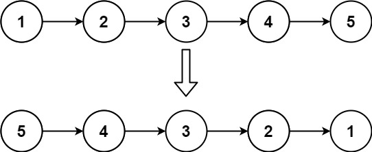
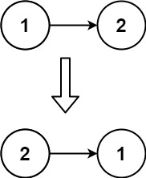

Given the head of a singly linked list, reverse the list, and return the reversed list.

Example 1:

Input: head = [1,2,3,4,5]
Output: [5,4,3,2,1]

Example 2:

Input: head = [1,2]
Output: [2,1]

Example 3:
Input: head = []
Output: []

Constraints:
The number of nodes in the list is the range [0, 5000].
-5000 <= Node.val <= 5000

Follow up: A linked list can be reversed either iteratively or recursively. Could you implement both?

## answer
/**
 * Definition for singly-linked list.
 * public class ListNode {
 * int val;
 * ListNode next;
 * ListNode() {}
 * ListNode(int val) { this.val = val; }
 * ListNode(int val, ListNode next) { this.val = val; this.next = next; }
 * }
 */
Iterative solution:
class Solution {
    public ListNode reverseList(ListNode head) {
        ListNode prev = null;
        ListNode current = head;
        while (current != null) {
            ListNode next = current.next;
            current.next = prev;
            prev = current;
            current = next;
        }
        return prev;
    }
}

1. 先初始化兩個變數 preve, current，
    current 被設定為linked list 的head。
2. 只要head(current)沒有到達linked list 的尾端，loop就會持續，因為等於null，表示到達尾端
3. 新建一個臨時node變數，來存head的下一個指向
4. 反轉head下一個指向，指到prev
5. prev 變成新的head，原先的head的下一個指向變成current

prev 變成新的 head，同時 current 移到下一個節點。
換句話說，prev 成為反轉後 linked list 的新頭節點，而 current 移到原始 linked list 的下一個節點，這樣在下一次迴圈中可以繼續進行反轉操作。
換言之，透過迴圈的反轉操作，每次迴圈都將一個節點添加到反轉後 linked list 的頭部，同時將 current 移到下一個節點，直到整個 linked list 都被反轉。

Recursive solution:
class Solution {
    public ListNode reverseList(ListNode head) {
        if (head == null || head.next == null)
            return head;
        ListNode newHead = reverseList(head.next);
        head.next.next = head;
        head.next = null;
        return newHead;
    }
}
